# TES-0D-02-01 DC Charger Controller

> 專為 TES-0D-02-01 標準設計的開源電動機車直流充電控制器。  
> 基於 ESP32-S3，使用 ESP-IDF 原生開發，支援 Web UI 監控、REST API 及 OTA 無線更新。

[](https://creativecommons.org/licenses/by-nc-sa/4.0/deed.zh_TW)
[](https://www.espressif.com/)
[](https://docs.espressif.com/projects/esp-idf/)
[](https://github.com/a950523a/TES-Taiwan-Electric-Scooter-Charging-Controller/actions/workflows/build-v3.yml)

---

## ⚠️ 免責聲明與安全警告

**本專案僅包含「控制板」的軟硬體設計，不包含功率級電源模組。**

1. **高壓危險**：本控制器需配合高壓直流電源使用，組裝與測試過程存在觸電與火災風險。
2. **非商業產品**：本專案為個人研究與技術驗證性質，未經 BSMI、UL 等安規認證。
3. **責任歸屬**：使用本專案所產生的任何後果（包括但不限於車輛損壞、電池故障、人身傷害），**使用者需自行承擔**。若不具備相關電學知識，請勿嘗試製作。
4. **BMS 風險**：CAN Bus 線路若接線錯誤或短路，**將導致車輛 BMS 永久性損壞**，請務必在低壓環境確認無誤後再上機。

---

## 🎯 專案範圍

本 Repository 專注於 **TES 協議控制邏輯** 的實作。

- **包含**：ESP32-S3 控制韌體、CAN Bus 通訊、狀態機邏輯、Web UI、OTA 更新
- **不包含**：功率級整流器、AC/DC 電源模組的控制碼（請依據選用的電源模組自行適配）

---

## ✨ 功能特點

### 核心協議
- **TES 標準相容**：完整實作 TES-0D-02-01 充電通訊協議（0x500/501/508/509/5F0/5F8）
- **寬範圍支援**：最高支援 120V / 100A (12 kW)
- **通用性**：適用於 eMoving iE125 等支援 TES 快充標準之車輛

### 智慧功能
- **Web UI / PWA**：內建單頁應用，1 秒即時更新電壓、電流、SOC、剩餘時間；可安裝至手機桌面
- **REST API**：`GET /status`、`POST /start`、`POST /stop`、`POST /ota`
- **mDNS**：連接 WiFi 後可用 `http://tes-charger.local` 直接存取
- **OTA 無線更新**：Web UI 一鍵從 GitHub Releases 拉取最新韌體，自動重刷
- **MQTT 遠端監控**：設定 broker 後可在任何網路環境即時監控並遠端 Start/Stop
- **Cloud PWA**：無需與設備在同一個 WiFi，透過 MQTT 遠端監控 👉 [monitor.html](https://a950523a.github.io/TES-Taiwan-Electric-Scooter-Charging-Controller/monitor.html)
- **推播通知**：充電開始／完成／故障時自動透過 ntfy 或 Webhook 推播到手機
- **充電紀錄**：最近 20 次充電的時長、電量 (Wh)、SOC 起訖、停止原因
- **OLED 狀態顯示**：SSD1306 128×64，顯示充電狀態、電壓電流、SOC、剩餘時間
- **設定選單**：長按 SETTING 進入，可調最大電壓、電流、目標 SOC、WiFi 設定
- **LuxBeacon**：LED SOC 脈衝燈號編碼

### 架構特點（V3 重構）
- **純 C99 狀態機**（`tes_protocol/`）：零平台依賴，可移植至 STM32 或 PC 單元測試
- **HAL 抽象層**：硬體相關程式碼全部隔離在 `charger_hal/` 和 `drivers/`
- **GitHub Actions CI/CD**：推送 tag 自動編譯並建立 Release

---

## 🚀 安裝韌體

### 方法一：瀏覽器一鍵燒錄（推薦，無需安裝任何工具）

使用 Chrome 或 Edge，前往 👉 **[GitHub Pages 燒錄工具](https://a950523a.github.io/TES-Taiwan-Electric-Scooter-Charging-Controller/)**

USB 連接主板，點「開始安裝」，全程自動完成（約 30–60 秒）。

### 方法二：命令列燒錄

從 [Releases](https://github.com/a950523a/TES-Taiwan-Electric-Scooter-Charging-Controller/releases/latest) 下載 `tes_charger_flash.bin`：

```bash
esptool.py --chip esp32s3 -p <PORT> write_flash 0x0 tes_charger_flash.bin
```

### 方法三：OTA 更新（已有 V3 韌體）

連線至設備 Web UI → 點「更新至最新韌體」→ 自動從 GitHub Releases 下載並重刷。

---

## 📶 初次設定 WiFi

燒錄完成後：

1. 用手機或電腦連接 WiFi：`TES-Charger`（無密碼）
2. 瀏覽器開啟 `http://192.168.4.1`
3. 在「設定」填入家用 WiFi SSID 與密碼 → 儲存
4. 重啟後自動連接，之後使用 `http://tes-charger.local`

---

## 📱 遠端監控

### 裝置端 PWA（同一個 WiFi）

連線至 `http://tes-charger.local`，點瀏覽器「加入主畫面」即可安裝為 PWA。

### Cloud PWA（任何網路）

👉 **[https://a950523a.github.io/.../monitor.html](https://a950523a.github.io/TES-Taiwan-Electric-Scooter-Charging-Controller/monitor.html)**

需先在裝置端 Web UI 設定 MQTT Broker（建議使用免費公共 broker：`mqtt://broker.hivemq.com:1883`）。
設定後點「取得遠端監控連結」，掃描 QR code 或複製連結，在任何地點開啟即可即時監控並遠端 Start/Stop。

---

## 🕹️ 操作說明

| 按鈕 | 待機 | 選單導覽 | 選單編輯 |
|------|------|----------|----------|
| START | 開始充電 | 上一項 | 微調 +0.1 / 長按 +1 |
| STOP | 停止充電 | 下一項 | 微調 −0.1 / 長按 −1 |
| SETTING 短按 | 循環 SOC 預設 (80→95→100%) | 確認 / 進入編輯 | 確認，回到導覽 |
| SETTING 長按 | 開啟設定選單 | — | — |
| EMERGENCY | 緊急停止（任何狀態有效） | 同左 | 同左 |

---

## 🛠️ 硬體設計

- **原理圖 / PCB**：`docs/PCB/` 目錄
- **BOM**：`docs/BOM_V2/` 目錄
- **主要元件**：ESP32-S3 N16R8、ADS1115、SSD1306 OLED、CAN Transceiver、繼電器模組

硬體設計以通用性為核心，亦適合使用萬用板手工搭建。

---

## 💻 開發環境（ESP-IDF）

```powershell
# 設定環境（Windows）
$env:IDF_PATH = "C:\Users\<user>\esp\v5.5.1\esp-idf"
# 詳見 CLAUDE.md 完整 PATH 設定

# 編譯
cd v3
idf.py build

# 燒錄
idf.py -p <PORT> flash monitor
```

詳細架構說明、任務設計、IPC 機制請參閱 [CLAUDE.md](CLAUDE.md)。

---

## 🤝 社群與支援

- **Facebook 社群**：[TES 電動機車充電技術交流](https://www.facebook.com/groups/791962053528872/?ref=share&mibextid=NSMWBT)
- **問題回報**：[GitHub Issues](https://github.com/a950523a/TES-Taiwan-Electric-Scooter-Charging-Controller/issues)

---

## ⚖️ 授權

本專案採用 **[CC BY-NC-SA 4.0](https://creativecommons.org/licenses/by-nc-sa/4.0/deed.zh_TW)** 授權。

- ✅ 分享與改作：需標示原作者，並以相同條款釋出
- 🚫 禁止商業使用：不得將本專案之設計圖檔、程式碼用於商業量產或販售營利

Copyright (c) 2025 Chris Huang

---

## 🔗 相關專案

- **[TES-Protocol](https://github.com/a950523a/TES-Protocol)**：本專案抽出的可攜式 C99 CAN codec（`tes_types.h` + `tes_codec.c`），可作為 submodule 用於 STM32 或其他平台
- **[LianMing-PSU-Controller](https://github.com/a950523a/LianMing-PSU-Controller)**：聯明電源 CAN Bus 控制器，可與本專案配合使用實現高功率便攜充電方案

---

## 影片

https://youtube.com/shorts/SKAtfQcCqX8?si=aqei7ZD7hVCWWM0R

https://youtu.be/vA7gSdK1YZQ?si=lSQAtU0p7vCutx1Y

## 照片

> 此為專案 V2 早期時所拍的照片，V2 後期轉為自行畫 PCB 並使用 ESP32-S3 開發。

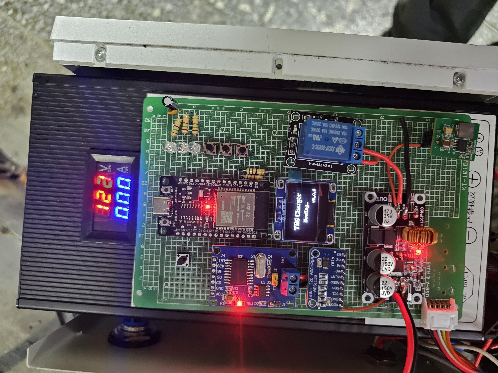
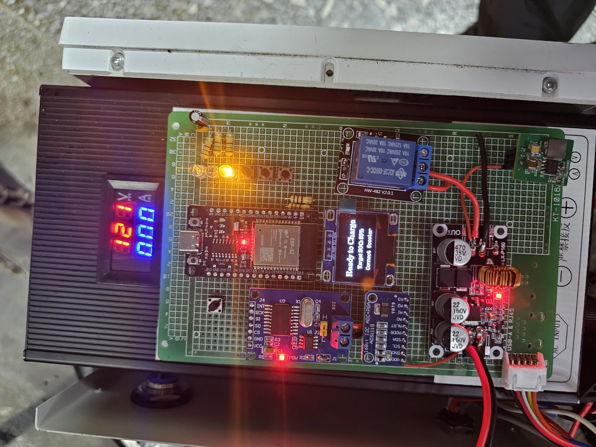
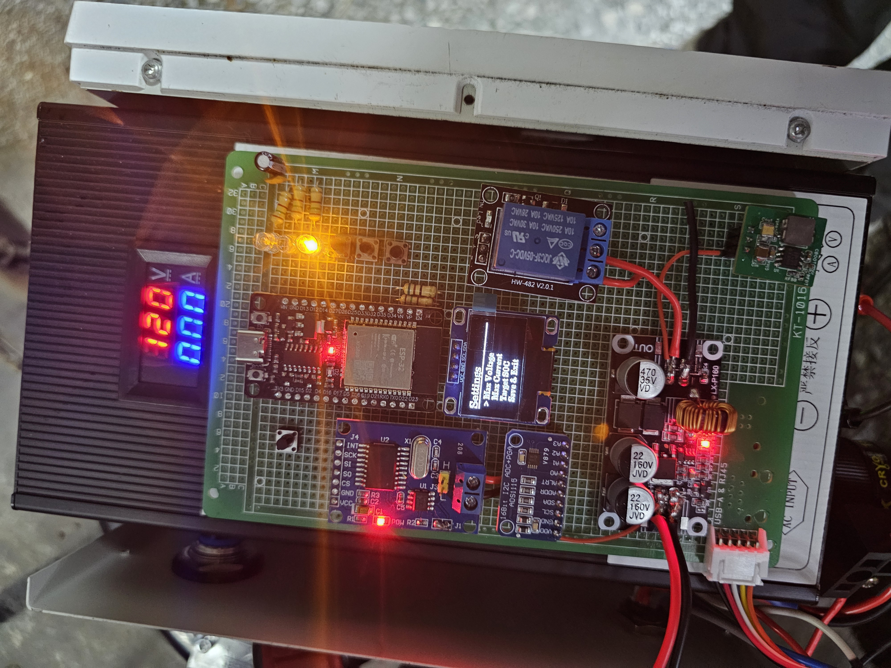
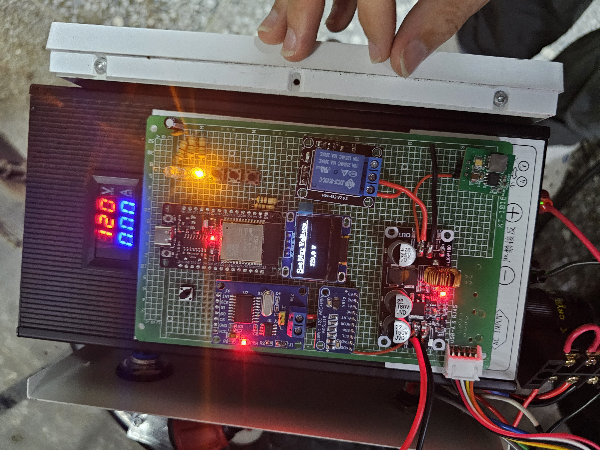
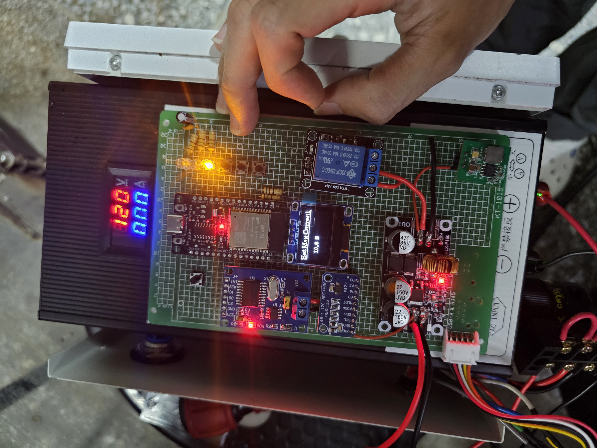
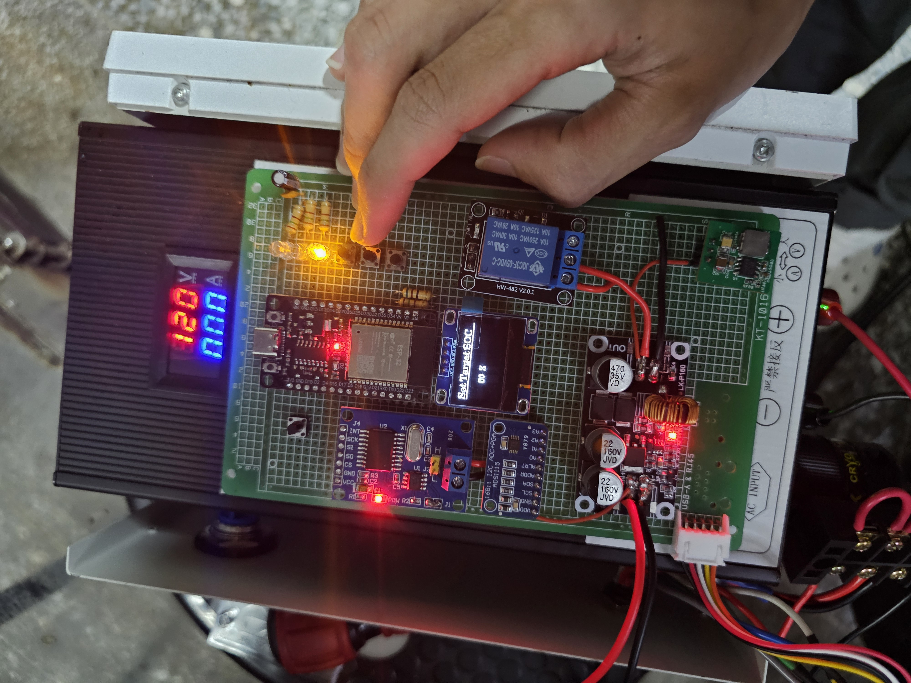
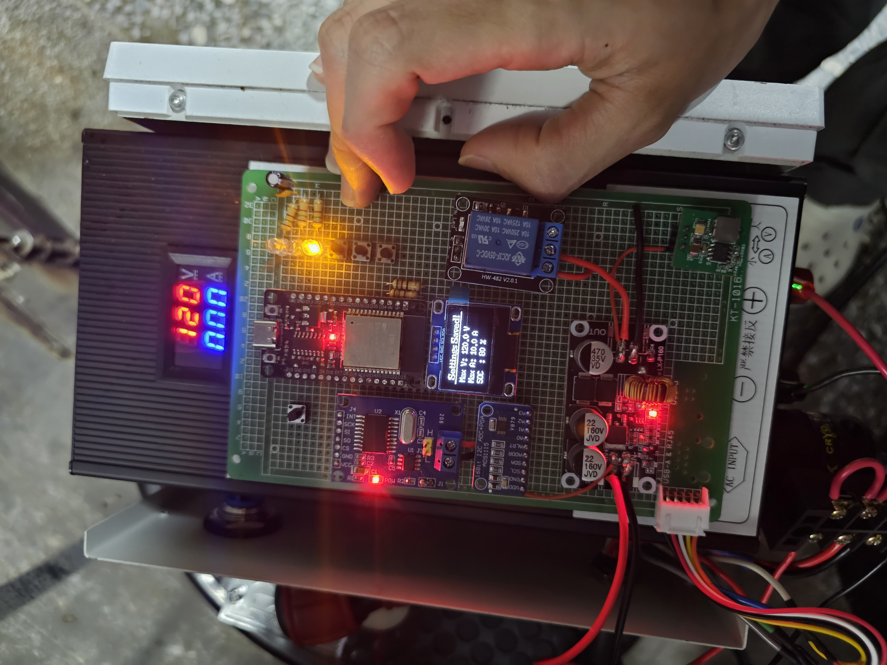
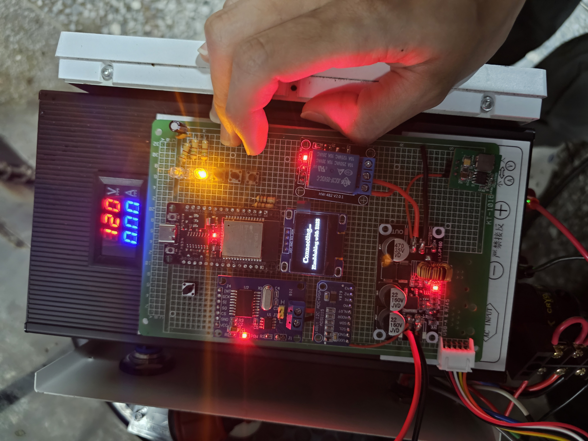
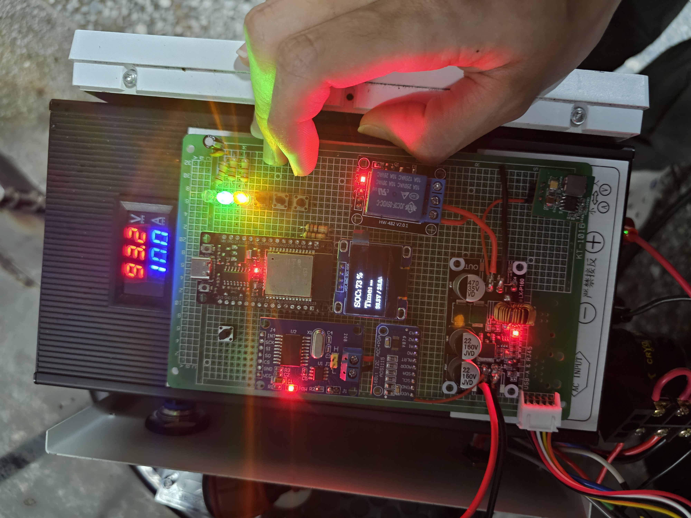
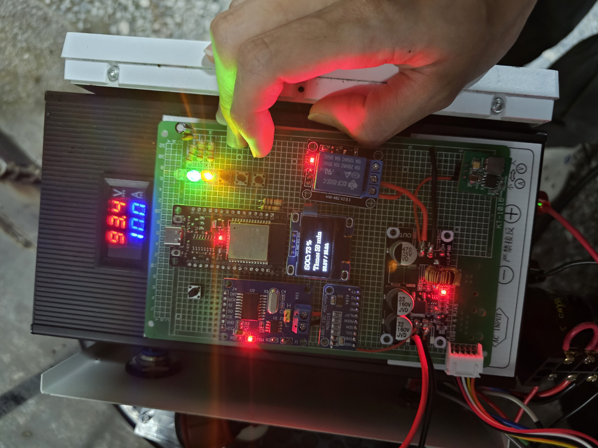
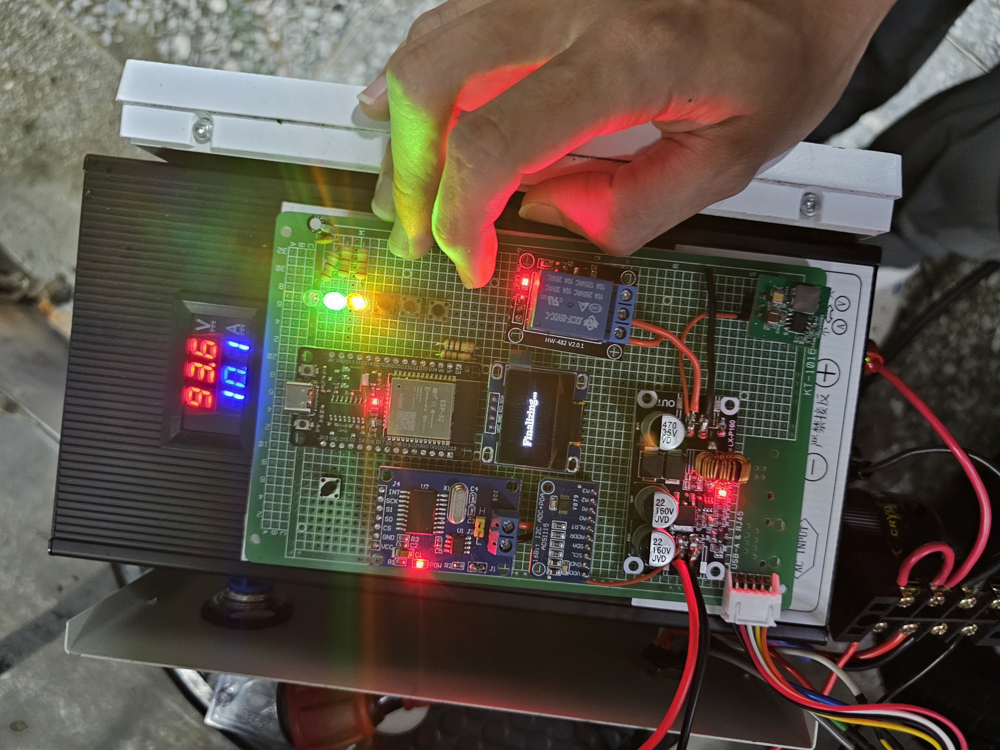
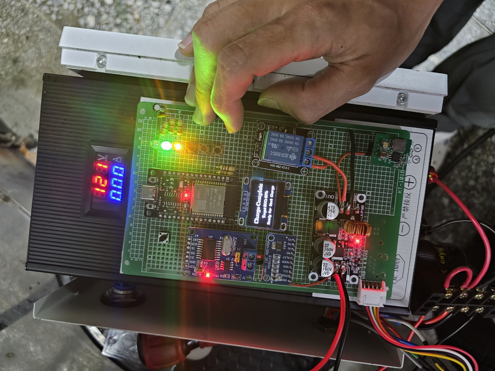
