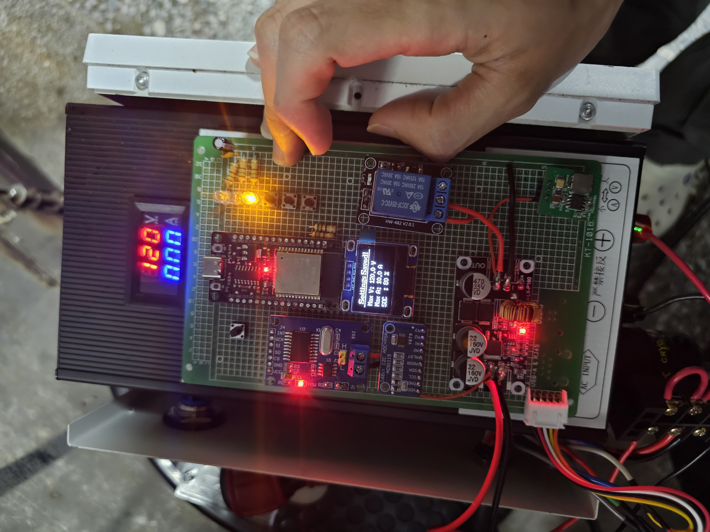
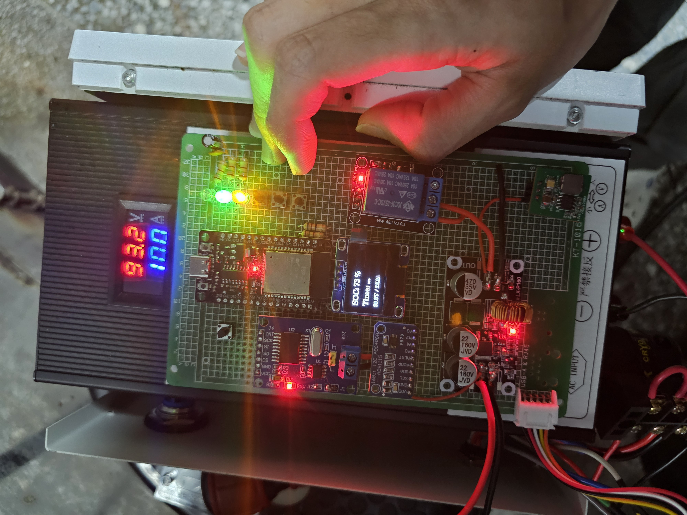

# TES-0D-02-01 Compatible DC Charger Controller for ESP32-S3

A DIY, open-source DC charger controller project for electric scooters, compatible with the TES-0D-02-01 industry standard, built upon the ESP32-S3 platform.

一個基於ESP32-S3開發的DIY開源電動機車直流充電樁控制器，相容TES-0D-02-01產業標準。

FB社群連結:https://www.facebook.com/groups/791962053528872/?ref=share&mibextid=NSMWBT

**禁止商業使用**

---

## ⚠️ 安全警告 (Safety Warning) ⚠️

**本專案僅為個人學習、研究和技術驗證目的而創建，並非商業級產品。**

充電樁是涉及高電壓、大電流的設備，直接關係到人身安全和財產（車輛、電網）安全。本專案提供的軟體和硬體設計思路**未經過任何形式的專業安全認證**（如UL、CE、BSMI等）。

**使用者在參考、複製或修改本專案時，必須自行承擔全部風險和責任。** 如果您不具備相關的專業電氣知識和技能，請勿嘗試製作或使用本設備。

---

## 功能特點 (Features)

*   **標準相容**: 遵循TES-0D-02-01標準的CAN Bus通訊協議。
*   **通用性設計**: 支援最高DC 120V輸出，適用於多種車輛。
*   **可調輸出**: 可調最大電壓、電流、SOC。
*   **狀態顯示**: 透過LED燈及OLED螢幕顯示待機、充電中、錯誤等狀態。
*   **網頁顯示及設定**: 透過Web UI顯示充電狀態及操作。
*   **安全保護**: 包含基礎的狀態機安全檢查和緊急停止功能。

## 硬體需求 (Hardware Requirements)

## 軟體與函式庫依賴 (Software & Dependencies)

  
## 安裝與使用 (Installation & Usage)

*  **CAN Bus模組要確認無短路才接上，否則會燒BMS!!!**
*  **務必將線材連接牢固絕緣包覆後再進行使用，引免因意外損壞車身零件**
  

## 授權 (License)

本專案採用 **[創用CC 姓名標示-非商業性-相同方式分享 4.0 國際 (CC BY-NC-SA 4.0)](https://creativecommons.org/licenses/by-nc-sa/4.0/deed.zh_TW)** 授權條款。

您可以自由地分享與改作本專案，惟需遵守「姓名標示」、「非商業性使用」及「相同方式分享」等條款。詳情請參閱授權協議全文。

Copyright (c) 2025 黃丞左(Chris Huang)

## 影片(Video)
https://youtube.com/shorts/SKAtfQcCqX8?si=aqei7ZD7hVCWWM0R

## 照片(Images)

